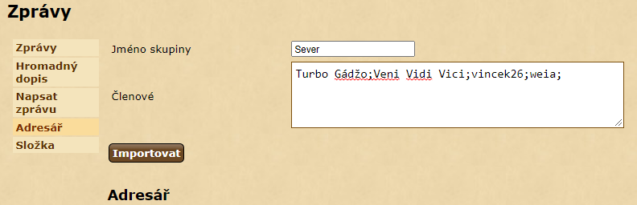

# Import kontaktů

_Jiné jazykové verze:_ [English](addressbook_en.md), [čeština](addressbook_cs.md)

Tento skript slouží pro import kontaktů v adresáři a rychlé vytváření skupin.
Skript funguje na stránce adresáře. 

```
javascript: $.getScript('https://papajik.github.io/TW-Scripts/scripts/addressbook.js');
```

### Návod k použití



* Spustit skript
* Zadat jména oddělená středníkem (lze použít výstup z [generátoru kontaktů](https://cz.twstats.com/cs77/index.php?page=mailing_list))
* (volitelné) Zadat název skupiny, do které budou kontakty přiřazeny
* Stisknout tlačítko importovat