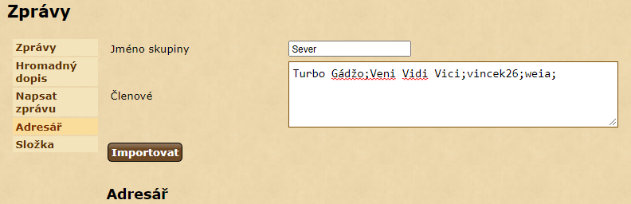

# Address book import
_Read this in other languages:_ [English](addressbook_en.md), [čeština](addressbook_cs.md)

This script is used to import contacts into address book. 
It can be used to add all given contacts into a group. 
Scripts work only on address book page. 

```
javascript: $.getScript('https://papajik.github.io/TW-Scripts/scripts/addressbook.js');
```

### Instructions



* SRun the script
* Enter player names divided by semicolon (You can output from  [mailing list generator](https://www.twstats.com/en121/index.php?page=mailing_list))
* (optional) Enter group name
* Click on the 'Import' button