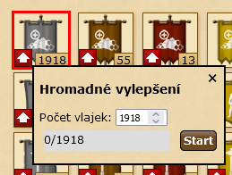

# Address book import
_Read this in other languages:_ [English](massFlagUpgrade_en.md), [čeština](massFlagUpgrade_cs.md)

This script is used to mass upgrade flags.
Script is sending upgrade request every 100 ms, therefore it is possible to process 30 flags per second.
Scripts work only on flag overview page.

```
javascript: $.getScript('https://papajik.github.io/TW-Scripts/scripts/addressbook.js');
```

### Instructions



* Run the script
* Click on "update flag" image
* Select how many flags you want to process
* Click on "start" button

Upgrade process can be stopped at any time by clicking on "X" or "stop" button. 