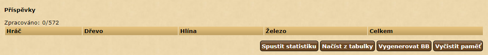

# Statistika dodaných surovin

_Jiné jazykové verze:_ [English](rss_en.md), [čeština](rss_cs.md)

Tento skript slouží pro vytvoření přehledu odeslaných/přijatých surovin. 
Lze jej využít například pro získání statistik během kmenového kolečka pro ražbu mincí. 
Skript pracuje v přehledu oznámení, přičemž sčítá suroviny ze všech viditelných oznámení na stránce.

```
javascript: $.getScript('https://papajik.github.io/TW-Scripts/scripts/rss.js');
```

### Návod k použití

#### Prvotní příprava pro skript
_Doporučuji oznámení vhodná pro pozdější sčítání přesunout do vlastní složky a poté sčítat oznámení z archivu. 
Velmi lehce se může stát, že při dvoudenní ražbě a vysokém počtu oznámení začne hra automaticky mazat poslední oznámení._ 


* Pomocí možnosti __Filtrovat dle názvu oznámení__ zobrazit jen relevantní oznámení (příklad: **dodává 15Dave vesnice**)

* Nastavit __Počet oznámení na stránce__ na hodnotu 1000

#### Skript


Skript lze ovládat pomocí následujících tlačítek:

##### Spustit statistiku

Skript začne procházet aktuálně zobrazená oznámení a začne vyplňovat tabulku surovin. 
Aby nedošlo k zahlcení serveru příliš mnoha dotazy, je mezi každým dotazem 200 ms mezera. 
Každé oznámení se zároveň ukládá do paměti prohlížeče, aby byl každý další běh skriptu rychlejší.
Při novém spuštění skriptu jsou nejprve zkontrolována uložená oznámení. 

##### Načíst z tabulky
Uživatel může vzít více tabulek a vložit jej pomocí tohoto tlačítka. Vkládá se dříve vygenerovaná tabulka v BB kódu, případně je možné vložit několik tabulek naráz. Každá vložená tabulka je pak přičtena do tabulky surovin. Toto je vhodné zejména pokud má uživatel příliš mnoho oznámení, jejichž počet se nevejde na jednu stránku, aby nemusel ručně sčítat počty ve více tabulkách.

##### Vygenerovat BB
Generuje tabulku v BB kódech pro vložení na kmenové fórum nebo pro sloučení více tabulek do jedné

##### Vyčistit paměť
Prohlížeč umožňuje uložit do lokální paměti omezené množství dat (přibližně 5 MB). 
Tento prostor je sdílen i s jinými skripty ([Hledač barbarských vesnic](https://forum.divokekmeny.cz/index.php?threads/vyhled%C3%A1v%C3%A1n%C3%AD-vesnic-barbar%C5%AF.27584/) může zabírat i více jak 1 MB paměti).
Aby nedocházelo k přeplnění paměti, umožňuje tento skript smazat veškerá dříve uložená oznámení. 
Po stisku tlačítka je uživatel seznámen uvidí uživatel počet již uložených oznámení a využití paměti. 
Je doporučeno smazat data při více jak 5.000 oznámení jinak může dojít k problémům při běhu tohoto i některých jiných skriptů.   

##### Řazení tabulky
Tabulku je možné seřadit pomocí kliku na zápatí tabulky.
