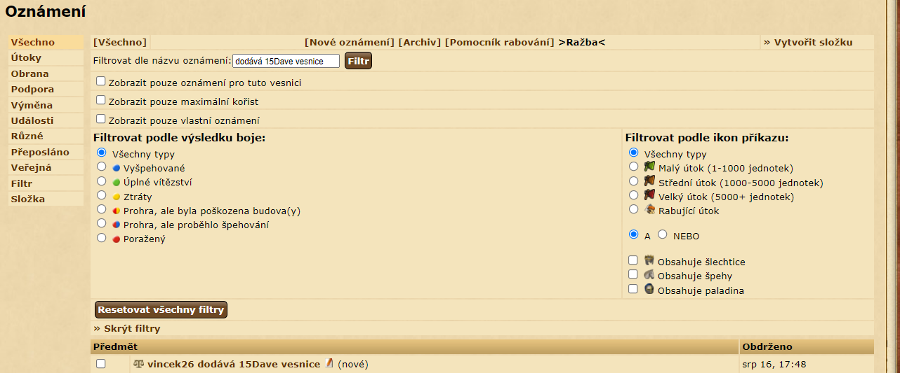
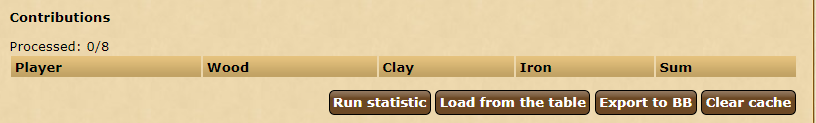

# Resources Sent Statistics

_Read this in other languages:_ [English](rss_en.md), [čeština](rss_cs.md)

This script is used to create an overview of sent / received resources.
An example of use is to obtain statistics during the coin minting.
The script works on the reports overview page. It sums up all resources from visible reports ont he page. 


```
javascript: $.getScript('https://papajik.github.io/TW-Scripts/scripts/rss.js');
```

### Instructions

#### Initial preparation
_It is recommended to move all required reports into custom folder to prevent deletion of reports_

* Use the  __Filter by report name__ option to display only relevant reports.

* Set __Reports per page__ to 1000

#### Script


There are following buttons to control the script

##### Run statistic
Starts reports gathering. There is 200 ms delay between each request. 
Every requested report is also saved to local cache to prevent overloading the server with too many requests.  

##### Load from the table
Insert previously exported table(s). 
It is possible to insert multiple tables at once. 
This function is useful if there is too much reports that can't fit into one page (1000+ reports)

##### Export to BB
Exports table be used in tribe forum or to sum two or more tables together.

##### Clear cache
Clears local memory. It is recommended to clear cache when there is more than 5,000 reports saved.

##### Sorting the table
It is possible to sort the table by clicking on the header of the table. 