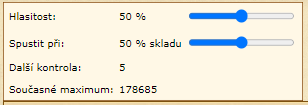

# Import kontaktů

_Jiné jazykové verze:_ [English](s_alarm_en.md), [čeština](s_alarm_cs.md)

Skript hlásí zaplnění skladiště. 
Pokud je skladiště zaplněno nad nastavenou úroveň, je přehrán zvuk budíku. 
Slouží ke kontrole skladiště pouze v aktuálně vybrané vesnici.
Kontrola skladiště probíhá každých 10 vteřin. Funguje na jakékoliv stránce. 

```
javascript: $.getScript('https://papajik.github.io/TW-Scripts/scripts/s_alarm.js');
```

### Návod k použití



* Spustit skript
* (volitelné) Nastavit úroveň hlasitosti a kontrolovanou kapacitu