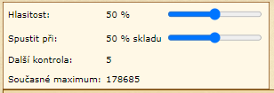

# Storage Alarm
_Read this in other languages:_ [English](s_alarm_en.md), [čeština](s_alarm_cs.md)

This script is used to check percentage of storage capacity. 
When storage exceed given percentage alarm sound is played. 
Works per one village only. Checks for update every 10 seconds. 
Script can be used on any page. 

```
javascript: $.getScript('https://papajik.github.io/TW-Scripts/scripts/s_alarm.js');
```

### Instructions



* Run the script
* (optional) Set volume and percentage of warehouse capacity
